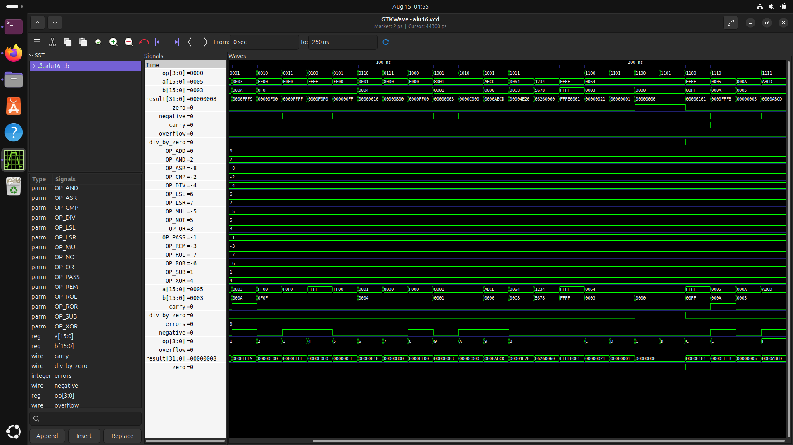

# ⚙️ 16-bit ALU (Arithmetic Logic Unit)

> A synthesizable 16-bit ALU written in Verilog supporting 16 operations — ADD, SUB, AND, OR, XOR, NOT, LSL, LSR, ASR, ROL, ROR, MUL, DIV, REM, CMP, PASS — with a 32-bit result bus for full-width multiply and five status flag outputs.


---

## 📖 Overview

The **16-bit ALU** is a fully synthesizable, purely combinational RTL design that performs 16 arithmetic and logic operations on two 16-bit operands selected via a 4-bit `op` code. It produces a **32-bit result** — wide enough to hold the full product of a 16×16 unsigned multiply — alongside five status flags: zero, negative, carry, signed overflow, and division-by-zero.

The design is verified through a self-checking testbench with targeted edge-case tests across all 16 operations, including signed overflow corner cases for ADD, borrow detection for SUB, arithmetic right shift sign extension, barrel rotate correctness, and division-by-zero fault handling. The design is then synthesized to a gate-level netlist with Yosys and a schematic generated via Graphviz.

---

## ✨ Features

- 🔢 **16 operations** — full arithmetic, logic, shift, rotate, multiply, divide, compare, and pass-through via 4-bit `op`
- 📐 **32-bit result bus** — wide enough to hold a full 16×16 unsigned multiply result without truncation
- 🚩 **5 status flags** — `zero`, `negative`, `carry`, `overflow` (signed), `div_by_zero`
- ➗ **Built-in multiply & divide** — combinational MUL, DIV, and REM baked directly into the ALU datapath
- 🔄 **Barrel shifts and rotates** — LSL, LSR, ASR (sign-extending), ROL, ROR with variable shift amount from `b[3:0]`
- 🔍 **Signed overflow detection** — correct two's complement overflow logic for ADD, SUB, and CMP
- ⚠️ **Division-by-zero flag** — `div_by_zero` asserts and result safely returns zero when `b == 0`
- ✅ **Self-checking testbench** — covers all 16 operations with explicit expected values using `check16` and `check32` tasks
- 🗺️ **Gate-level schematic** — Yosys + Graphviz renders the synthesized netlist as a DOT/PNG

---

## 🛠️ Tools Used

| Tool | Purpose |
|------|---------|
| **Icarus Verilog** | RTL simulation and testbench execution |
| **Yosys** | Synthesis from RTL to gate-level netlist |
| **GTKWave** | VCD waveform inspection with saved `.gtkw` signal layout |
| **Graphviz** | Renders Yosys `.dot` output to gate-level schematic |

---

## 🔌 Port Description

| Port | Direction | Width | Description |
|------|-----------|-------|-------------|
| `a` | Input | 16-bit | First operand |
| `b` | Input | 16-bit | Second operand / shift amount `b[3:0]` |
| `op` | Input | 4-bit | Operation select (see table below) |
| `result` | Output | 32-bit | Operation result (full-width for MUL) |
| `zero` | Output | 1-bit | High when `result[15:0] == 0` |
| `negative` | Output | 1-bit | High when `result[15] == 1` |
| `carry` | Output | 1-bit | Carry-out (ADD) / borrow (SUB, CMP) |
| `overflow` | Output | 1-bit | High on signed two's complement overflow |
| `div_by_zero` | Output | 1-bit | High when DIV or REM is attempted with `b == 0` |

---

## ⚙️ Operation Table

| `op` | Mnemonic | Description |
|------|----------|-------------|
| `4'b0000` | **ADD** | `result = a + b`, sets `carry` and `overflow` |
| `4'b0001` | **SUB** | `result = a - b`, sets `carry` (borrow) and `overflow` |
| `4'b0010` | **AND** | `result = a & b` |
| `4'b0011` | **OR** | `result = a \| b` |
| `4'b0100` | **XOR** | `result = a ^ b` |
| `4'b0101` | **NOT** | `result = ~a` |
| `4'b0110` | **LSL** | Logical shift left by `b[3:0]` |
| `4'b0111` | **LSR** | Logical shift right by `b[3:0]` |
| `4'b1000` | **ASR** | Arithmetic shift right (sign-extending) by `b[3:0]` |
| `4'b1001` | **ROL** | Rotate left by `b[3:0]` |
| `4'b1010` | **ROR** | Rotate right by `b[3:0]` |
| `4'b1011` | **MUL** | `result[31:0] = a * b` (full 32-bit product) |
| `4'b1100` | **DIV** | `result = a / b`, asserts `div_by_zero` if `b == 0` |
| `4'b1101` | **REM** | `result = a % b`, asserts `div_by_zero` if `b == 0` |
| `4'b1110` | **CMP** | Computes `a - b`, updates flags only (same as SUB) |
| `4'b1111` | **PASS** | `result = a`, pass operand A through unchanged |

---
## Waveform Diagram



## 🚀 Getting Started

### Prerequisites

```bash
# Ubuntu / Debian
sudo apt install iverilog gtkwave yosys graphviz
```

### Installation

1. **Clone the repository**

```bash
git clone https://github.com/deep-chatterjee/16-bit-ALU.git
cd 16-bit-ALU
```

2. **Run the simulation**

```bash
make sim      # Compile and run testbench, print pass/fail report
make wave     # Open VCD in GTKWave with saved signal layout
```

3. **Run synthesis**

```bash
make synth    # Generate gate-level netlist via Yosys
make stats    # ABC gate-mapped synthesis for area estimate
```

---

## ⚙️ Makefile Targets

| Command | Action |
|---------|--------|
| `make sim` | Compile design + testbench and run simulation |
| `make wave` | Run sim then open `alu16.vcd` in GTKWave with `alu16.gtkw` layout |
| `make synth` | Synthesize with Yosys, write `alu16_synth.v` |
| `make stats` | Synthesize + ABC gate mapping for cell area estimate |
| `make clean` | Remove generated `.vvp`, `.vcd`, `alu16_synth.v` |

---

## 💻 How It Works

```
Inputs: a[15:0], b[15:0], op[3:0]
               ↓
     Combinational always @(*)
               ↓
        Decode op[3:0]
  ┌──────────────────────────────────────────────────┐
  │ 0000 ADD  │ 0001 SUB  │ 0010 AND  │ 0011 OR     │
  │ 0100 XOR  │ 0101 NOT  │ 0110 LSL  │ 0111 LSR    │
  │ 1000 ASR  │ 1001 ROL  │ 1010 ROR  │ 1011 MUL    │
  │ 1100 DIV  │ 1101 REM  │ 1110 CMP  │ 1111 PASS   │
  └──────────────────────────────────────────────────┘
               ↓
     Compute result[31:0]
               ↓
     Derive flags (from result[15:0]):
       carry       = bit 16 of extended ADD/SUB
       overflow    = signed two's complement overflow
       zero        = (result[15:0] == 16'h0000)
       negative    = result[15]
       div_by_zero = (b == 0) on DIV or REM
```

---

## ✅ Testbench Coverage

The testbench (`alu16_tb.v`) uses two reusable check tasks:

- **`check16`** — validates `result[15:0]` plus all five flags simultaneously
- **`check32`** — validates the full 32-bit `result` for MUL operations

| Test Group | Key Cases Covered |
|------------|-------------------|
| **ADD** | Normal, signed overflow (`0x7FFF + 1`), carry wrap (`0xFFFF + 1`) |
| **SUB** | Normal, borrow/negative (`3 - 10`) |
| **Logic** | AND, OR, XOR, NOT with `0xFF00` / `0x0F0F` patterns |
| **Shifts** | LSL `×4`, LSR `×4`, ASR sign-extension on `0xF000` |
| **Rotates** | ROL/ROR by 1 on `0x8001`, zero-shift identity on `0xABCD` |
| **MUL** | `100×200`, `0x1234×0x5678`, max `0xFFFF×0xFFFF = 0xFFFE0001` |
| **DIV / REM** | `100/3=33 rem 1`, `0xFFFF/0xFF=0x101`, divide-by-zero fault |
| **CMP** | `5 vs 10`, `10 vs 5` — flag-only subtraction |
| **PASS** | `0xABCD` passthrough |

Final console output:
```
============================================================
           ALL TESTS PASSED!
============================================================
```

---

## 📁 Project Structure

```
16-bit-ALU/
├── alu16.v                 # RTL design (synthesizable Verilog)
├── alu16_tb.v              # Self-checking testbench
├── alu16_synth.v           # Yosys gate-level netlist (generated)
├── alu16_schematic.dot     # Graphviz DOT schematic (generated)
├── alu16.gtkw              # GTKWave saved signal layout
├── Makefile                # Build automation
├── .gitignore
└── README.md
```

---

## 🧠 What I Learned

- Designing a 16-operation combinational ALU with a 4-bit opcode and a 32-bit result bus in Verilog
- Implementing correct signed two's complement overflow detection for ADD, SUB, and CMP using MSB comparison
- Extending a 16-bit datapath to handle full-width 32-bit multiply results without truncation
- Writing arithmetic right shift (ASR) with `$signed()` cast for correct sign extension
- Implementing barrel rotate (ROL/ROR) using concatenated shift expressions
- Handling divide-by-zero safely in RTL with a dedicated status flag rather than undefined behaviour
- Writing a structured self-checking testbench with separate `check16` and `check32` tasks for mixed-width validation
- Running multi-stage Yosys flows (`synth`, ABC gate mapping, `stat`) to interpret area estimates
- Understanding how a feature-complete ALU — with multiply, divide, shifts, and rotates — maps to a real CPU instruction set

---

## 🔮 Future Improvements

- Add a signed multiply (`MULS`) and signed divide (`DIVS`) using `$signed()` operands
- Implement a multi-cycle divider using sequential logic to reduce combinational depth
- Parameterise the design to an N-bit ALU using a Verilog `parameter`
- Write a UVM-based constrained-random testbench with functional coverage bins for all 16 opcodes
- Target a real FPGA (Xilinx / Intel) and report post-place-and-route timing and LUT/DSP usage
- Connect to a register file and instruction decoder to form a minimal 16-bit CPU datapath

---

## 👤 Author

**Deep Chatterjee**  
[GitHub](https://github.com/deep-chatterjee)

---

## 📄 License

This project is licensed under the MIT License — see [LICENSE](LICENSE) for details.
